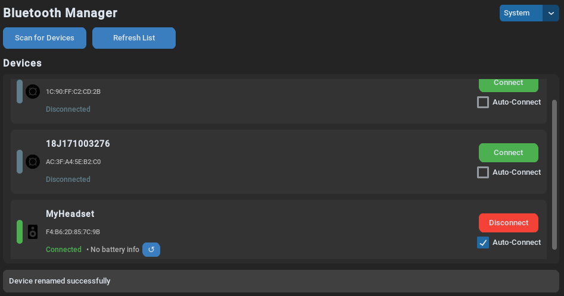

# BlueSync

BlueSync is a modern Bluetooth device manager for Linux systems that provides an intuitive graphical interface for managing Bluetooth connections. It features a clean, customizable UI and system tray integration for easy access.

## Features

- **Modern Interface**: Clean and intuitive GUI built with customtkinter
- **System Tray Integration**: Quick access to common functions via system tray icon
- **Device Management**:
  - Connect/disconnect devices
  - View battery levels (when supported)
  - Auto-connect feature for frequently used devices
  - Custom device names
  - Device type detection and appropriate icons
- **Real-time Updates**: Live battery level monitoring and connection status
- **Theme Support**: Light, dark, and system theme options
- **Notification System**: Battery level alerts and connection status updates

## Screenshot of Application


## Requirements

- Python 3.x
- Linux system with BlueZ
- Required system packages:
  - libdbus-1-dev
  - Bluetooth utilities

## Installation

1. Clone the repository:
   ```bash
   git clone https://github.com/emirhankskn/BlueSync.git
   cd BlueSync
   ```

2. Run the installation script:
   ```bash
   chmod +x install.sh
   ./install.sh
   ```

The installer will:
- Create a virtual environment
- Install required Python packages
- Set up desktop integration
- Create necessary symbolic links

## Usage

You can start BlueSync in two ways:
1. From the application menu (look for the BlueSync icon)
2. From the terminal:
   ```bash
   bluesync
   ```

### Features:
- **Scan for Devices**: Click "Scan for Devices" to discover nearby Bluetooth devices
- **Connect/Disconnect**: Easily connect or disconnect devices with a single click
- **Auto-Connect**: Enable auto-connect for frequently used device
- **Custom Names**: Double-click a connected device's name to set a custom name
- **Battery Monitoring**: View battery levels for supported devices (In Progress)
- **System Tray**: Access quick functions from the system tray icon

## Uninstallation

To uninstall BlueSync:
```bash
./uninstall.sh
```

## License

This project is licensed under the MIT License - see the [LICENSE](LICENSE) file for details.

## Contributing

Contributions are welcome! Please feel free to submit pull requests.